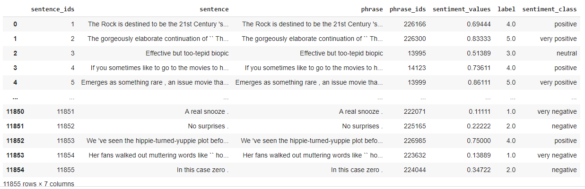
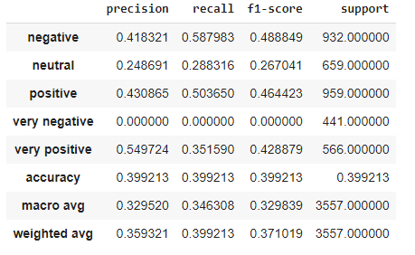

# Sentiment Analysis with Stanford Sentiment Treebank Dataset

### Introduction

In the fine-grained version of Stanford Sentiment Treebank (SST) dataset, there are 5 different sentiment classes - **very negative, negative, neutral, positive and very positive** . In this notebook we are trying to predict sentiment on SST dataset using `LSTM` and `PyTorch`.

### Dataset 

The [Stanford Sentiment Treebank](https://nlp.stanford.edu/sentiment/) (SST-5, or SST-fine-grained) dataset consists of 11,855 sentences extracted from movie reviews with fine-grained sentiment labels [1-5], as well as 215,154 phrases that compose each sentence in the dataset. 

The typical breakdown of fine-grained sentiment uses *five* discrete classes, as shown below (fig 1. a).

​											*fig 1.a	Typical class labels for fine-grained sentiment classification*

For the current task following files are used from the data repository 

- datasetSentences.txt which contains 11,855 sentences extracted from movie reviews.
- dictionary.txt which contains 215,154 phrases that compose each sentence in the review dataset and their IDs, separated by a vertical line
- sentiment_labels.txt which contains all phrase ids and the corresponding sentiment labels, separated by a vertical line.

Master dataset after combining data from all the above files is as shown below :

After preprocessing, the dataset is split into train -test with a 70:30 ratio. Following is the final train data set extracted from the above master dataset.

​													*fig 1.c Sample of SST-5 training data* 

We have 8296 samples in train, 3557 in test. 
Class distribution in the training data is as shown in fig 1.d. Most of the training samples belong to classes 2 and 4 (the weakly negative/positive classes). A sizeable number of samples belong to the neutral class(class 5). Barely 12% of the samples are from the strongly negative class (class 1)

​															*fig 1.d Number of samples in training set*

### Prepare data

We use `TorchText` to prepare data. `TEXT` field is used to define how the review should be processed, and the `LABEL` field to process the sentiment.

Next, we have to build a *vocabulary*. This is effectively a lookup table where every unique word in your data set has a corresponding *index* (an integer).

We perform this step as our model cannot operate on strings, only numbers. Each *index* is used to construct a *one-hot* vector for each word. Next is the use of pre-trained word embeddings. Now, instead of having our word embeddings initialized randomly, they are initialized with these pre-trained vectors. We get these vectors simply by specifying which vectors we want and passing it as an argument to build_vocab.  `TorchText` handles downloading the vectors and associating them with the correct words in our vocabulary.

Here, we'll be using the `glove.6B.100d ` vectors. 6B indicates these vectors were trained on 6 billion tokens and 100d indicates these vectors are 100-dimensional.

The theory is that these pre-trained vectors already have words with a similar semantic meaning close together in vector space, e.g. "terrible", "awful", "dreadful" are nearby. This gives our embedding layer a good initialization as it does not have to learn these relations from scratch.

The final step of preparing the data is creating the iterators. We iterate over these in the training/evaluation loop, and they return a batch of examples (indexed and converted into tensors) at each iteration.

We'll use a `BucketIterator` which is a special type of iterator that will return a batch of examples where each example is of a similar length, minimizing the amount of padding per example.

### **Build the Model**

We use the `Embedding` and `LSTM` modules in` PyTorch` to build a simple model for classifying reviews.

1. First, the words in our texts are pushed into an Embedding layer, which we have established as a 100-dimensional vector embedding.
2. Then fed into 2 stacked-LSTMs with 256 hidden features.
3. Finally, the output of the LSTM (the final hidden state after processing the incoming text) is pushed through a standard fully-connected layer with five outputs corresponding to our five possible classes (very negative, negative, neutral, very positive, or positive ).

Model and parameters

​												*fig 1.h model*

- Embedding_dim = 100
- Hidden_nodes = 256
- Output_nodes = 5
- Number of layers = 2
- Dropout = 0.5

Optimizer:  `Adam` adapts the learning rate for each parameter, giving parameters that are updated more frequently lower learning rates and parameters that are updated infrequently higher learning rates.

Loss function : `CrossEntropyLoss`

Learning rate : 2e-4

Epochs :30

### Results 

Refer to code and results  [here](https://github.com/krishnarevi/TSAI_END2.0_Session7/blob/main/Assignment_1/Sentiment_analysis_stanford_treebank.ipynb)

| Train Accuracy | Test accuracy |
| -------------- | ------------- |
| 76.1%          | 38.9%         |

###### Training and validation logs:

###### Training and test loss:

###### Training and test accuracy: 

###### Confusion matrix:

###### Test classification report

###### Sample predictions:

Correct predictions 😄:

Incorrect predictions 😑 :

